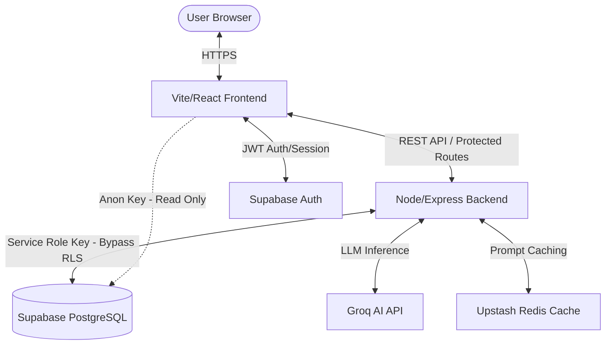
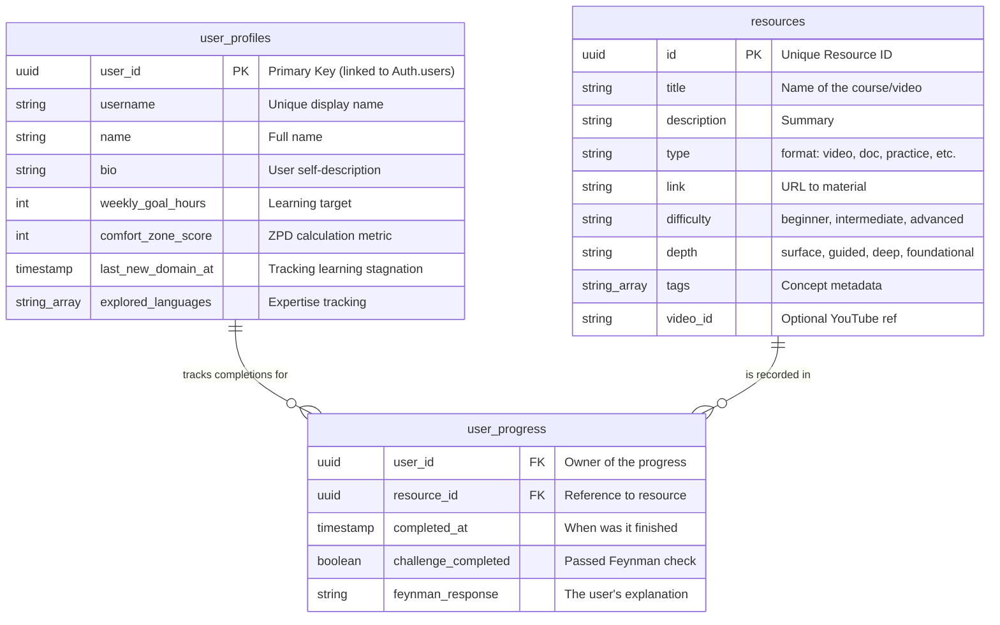
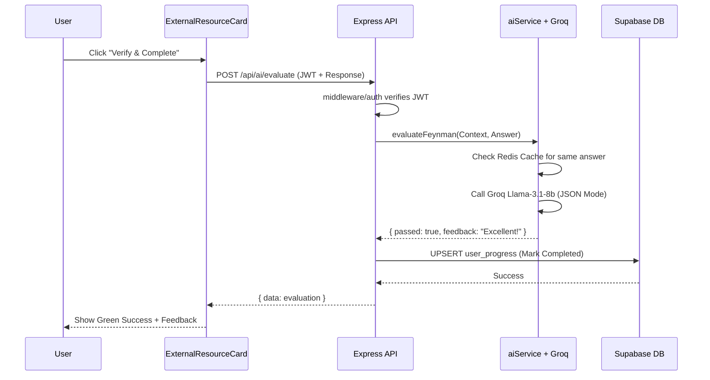
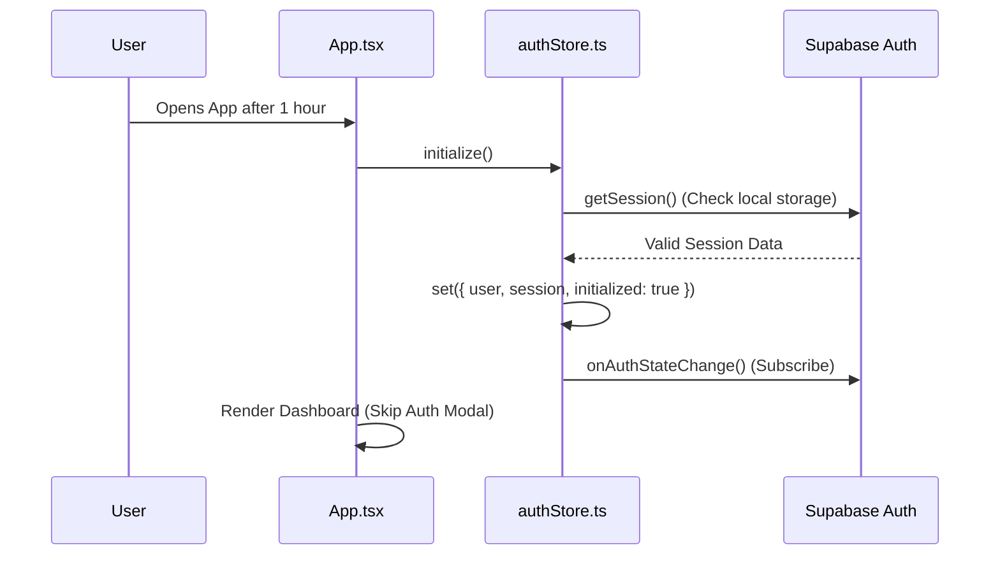

# Project Hail Mary: System Architecture & Security Document

As the Principal Software Architect and Security Engineer, I have performed a deep-dive analysis of the **Project Hail Mary** codebase. This document outlines the structural design, data relationships, and security protocols ensuring the application is robust, scalable, and secure.

---

## 1. High-Level System Architecture

The application follows a **Decoupled Monolith** architecture within a monorepo structure. While the Frontend and Backend are separate services, they share a unified domain logic via Supabase as the central data and identity hub.

### Component Responsibilities
*   **Frontend (Vite/React)**: Responsible for the **Presentation Layer** and **Client-Side Navigation**. It manages local UI state (Zustand) and orchestrates the user journeys.
*   **Backend (Node/Express)**: Acts as the **Secure Gateway** for sensitive operations. It handles complex business logic (AI evaluations, progress syncing) that requires secret keys.
*   **Supabase (DB/Auth)**: The **Infrastructure Layer**. It provides managed PostgreSQL and identity management (JWT minting).
*   **External APIs (Groq/Redis)**: The **Intelligence & Performance Layer**. Groq provides AI reasoning, while Upstash Redis ensures we don't pay for the same AI query twice.

#### Why the Frontend doesn't talk to Groq directly:
1.  **Secret Protection**: Connecting directly from the browser would expose the `GROQ_API_KEY` to any user, allowing them to steal your credits.
2.  **Request Orchestration**: The backend needs to "wrap" the AI response with database updates (marking a mission complete) in a single trusted flow.
3.  **Cost Control**: The backend checks the Redis cache *before* calling the paid API—a check that can only be securely managed on a server.

---

## 2. Database Schema & Data Models

Project Hail Mary uses a relational schema designed for high-speed lookups and strict data integrity.

### Data Integrity Constraints
*   **UUIDs**: All primary keys utilize UUIDs to prevent "ID guessing" attacks.
*   **Foreign Keys**: `user_progress` maintains strict referential integrity; if a user is deleted, their progress is cleaned up (Cascading Delete).
*   **Optionality**: Fields like `github_url` are `NULLable`, allowing for frictionless onboarding without requiring all social links up front.

---

## 3. Security Posture & Measures

### Authentication Flow
The system utilizes **JWT (JSON Web Tokens)** as the source of truth for identity.
1.  **Login**: Supabase Auth verifies credentials and returns a JWT to the browser.
2.  **Storage**: The token is stored in **Local Storage** (managed by the Supabase client) to survive page refreshes.
3.  **Transmission**: For every request to the Express API (e.g., `/api/ai/evaluate`), the frontend attaches the token to the `Authorization: Bearer <token>` header.

### Row-Level Security (RLS)
Supabase DB is protected by SQL-level policies. Even if a hacker stole the `Anon Key`, they could not edit your profile.
*   **Frontend Access**: Limited by policies such as `CREATE POLICY "Users can update own profile" ON user_profiles FOR UPDATE USING (auth.uid() = user_id)`.
*   **Backend Bypass**: The Node server uses the **Service Role Key**. This key has "God Mode" permissions (`bypassrls`), allowing the backend to save progress data for *any* user without getting blocked by RLS.

### API Protection (`requireAuth` Middleware)
The backend does not trust any user input regarding identity.
1.  The `requireAuth` middleware extracts the Bearer token.
2.  It calls `supabase.auth.getUser(token)`. This is a server-side check that validates the token hasn't been tampered with and hasn't expired.
3.  If the token is fake or missing, the API returns a `401 Unauthorized` and stops the request before it touches any business logic.

### Environment Variable Isolation
The monorepo uses a strict "Need to Know" basis for secrets:
*   **`apps/web/.env`**: Uses the `VITE_` prefix. These variables are bundled into the JavaScript code sent to the browser. Only the public `Anon Key` and `API URL` live here.
*   **`apps/api/.env`**: Contains **Secret Keys** (Groq, Redis, Supabase Service Key). These are never sent to the browser, ensuring they remain encrypted at rest on the server.

### Rate Limiting & Cost Control (FDoS Prevention)
The `aiService.ts` implements a **Financial Denial of Service** shield using Upstash Redis.
*   **Caching**: Every AI response (Doubts or Feynman evaluations) is hashed and stored in Redis.
*   **The Logic**: If 1,000 users ask the exact same doubt about "React Hooks," the server calls the AI once, and the next 999 users get the answer from Redis in milliseconds, costing exactly $0.00 in AI credits.

---

## 4. Core Workflows (Sequence Diagrams)

### A. The "Verify & Perfect" Feynman Flow
This flow ensures a user actually learned the material before giving them credit.

### B. The Authentication & Session Restore Flow
Ensures the user stays logged in even after closing the tab.

---

## 5. Potential Vulnerabilities & Future Hardening

1.  **Payload Size Flooding**: Currently, a user could send a 10MB text block as a "Feynman Response," potentially slowing down the JSON parser.
    *   **Senior Patch**: Implement `express-rate-limit` and set `body-parser` limits (e.g., `limit: '10kb'`) specifically on AI routes.
2.  **XSS in AI Output**: If the AI is manipulated into returning a `<script>` tag in its feedback, it could execute in the browser.
    *   **Senior Patch**: Ensure all AI responses are sanitized using `DOMPurify` on the frontend before rendering them in the `DoubtSolverModal`.
3.  **Database Connection Pooling**: Under heavy load, the direct Supabase client might hit connection limits.
    *   **Senior Patch**: Transition to **Supabase Connection Pooling** (using PgBouncer) for the backend to handle 10,000+ concurrent connections without performance degradation.
